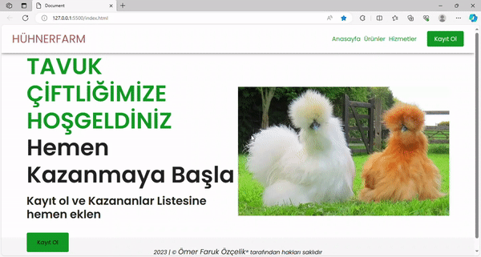

<h1>Hühnerfarm-Site</h1>

This new project I made is a chicken farm project.
I created this project by writing simple and understandable codes with still scss.
I added some visuals.
Responsive features have been added to the buttons.
It can be used easily on both tablets, computers and phones.

<h2>Languages and Codes Used</h2>

HTML - CSS - SCSS

<h2>Screenshot</h2>

